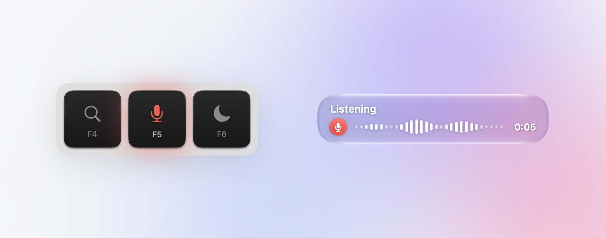

<p align="center">
  <picture>
    <source media="(prefers-color-scheme: dark)" srcset="docs/hero-dark.png">
    
  </picture>
</p>

<h1 align="center">Voicer</h1>

<p align="center">
  Hold <kbd>🎤</kbd>, speak, and let go. Your words appear wherever you're typing.<br>
  On-device and offline.
</p>

<p align="center">
  <a href="https://github.com/kimagedon/voicer/releases/latest"><b>Download</b></a> &nbsp;·&nbsp; macOS 26+ &nbsp;·&nbsp; Apple silicon
</p>

<br>

|  |  |
| --- | --- |
| Hold <kbd>🎤</kbd> | Talk, then let go to paste |
| Tap <kbd>🎤</kbd> | Hands-free until you tap again |
| <kbd>esc</kbd> | Cancel |

The first time you open Voicer, go to System Settings → Privacy & Security and click **Open Anyway**. Then allow Accessibility and Microphone.

### Build from source

```sh
git clone https://github.com/kimagedon/voicer.git && cd voicer && ./build.sh
```

You'll need the Xcode Command Line Tools and CMake. See [CONTRIBUTING.md](CONTRIBUTING.md) for details.

<sub>Built on [whisper.cpp](https://github.com/ggml-org/whisper.cpp) and [Whisper](https://github.com/openai/whisper). [MIT](LICENSE).</sub>
